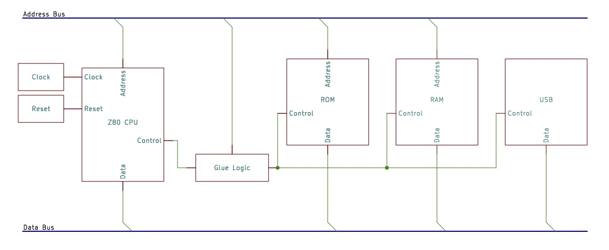
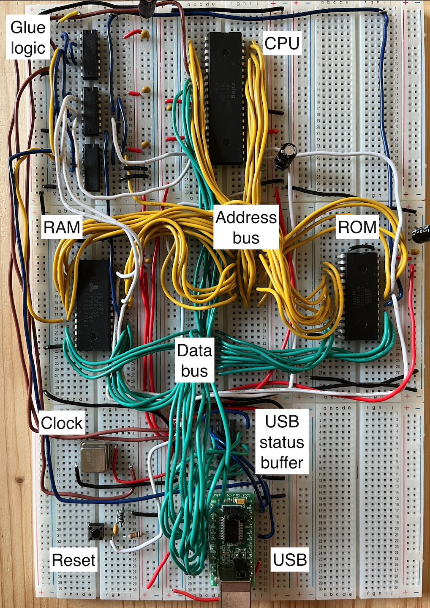
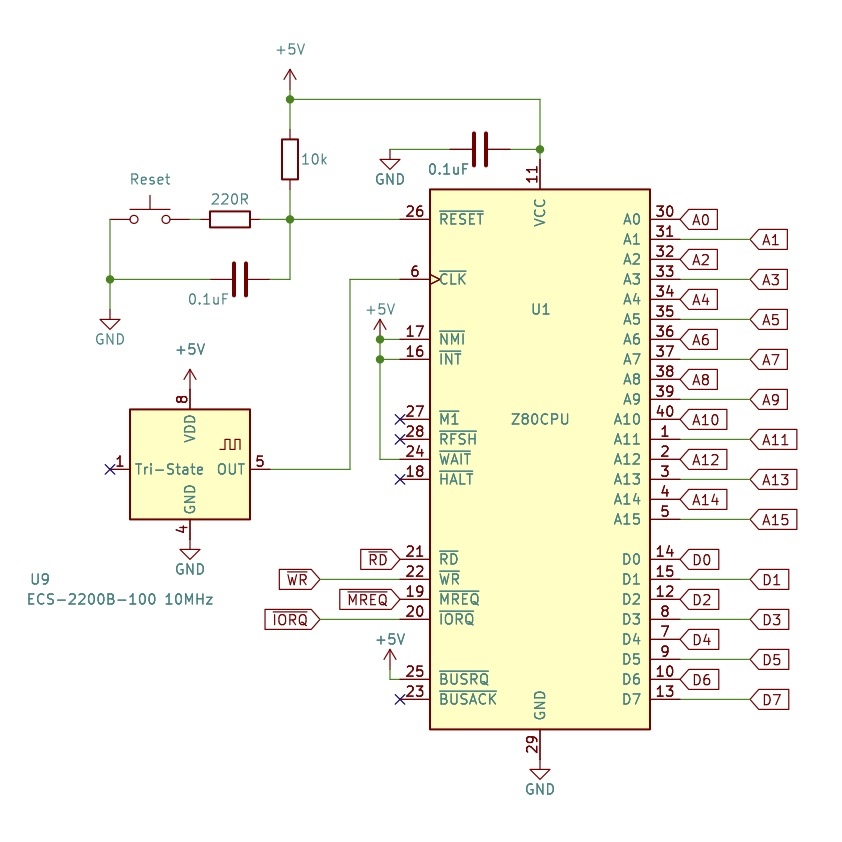
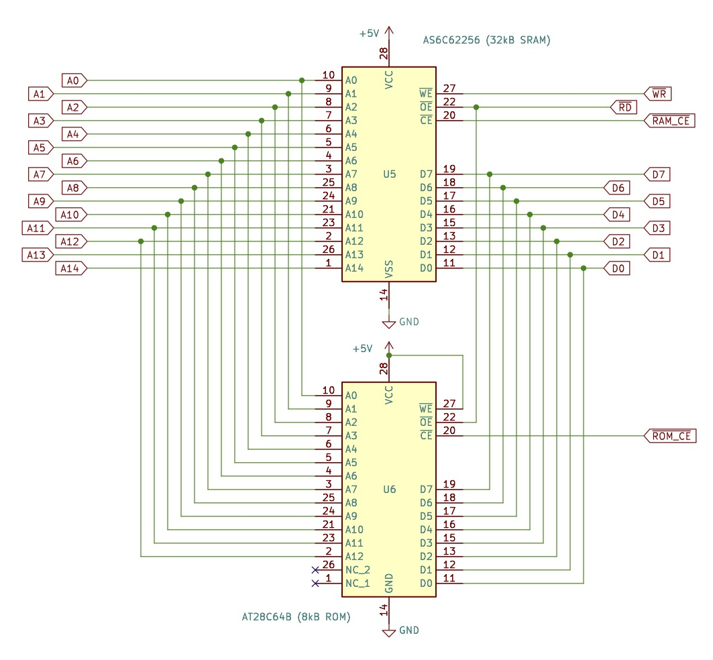
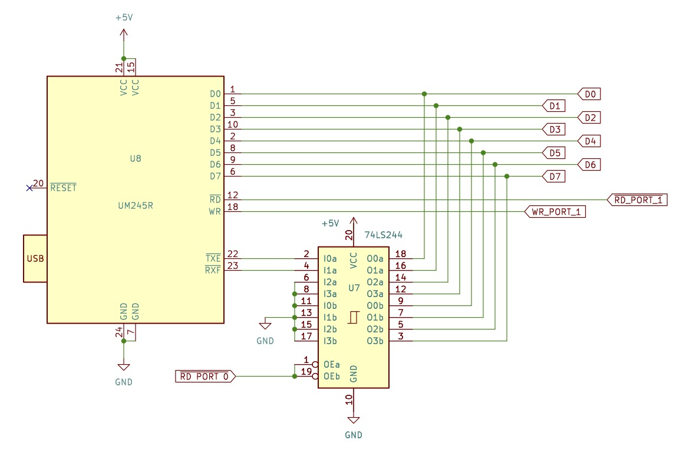
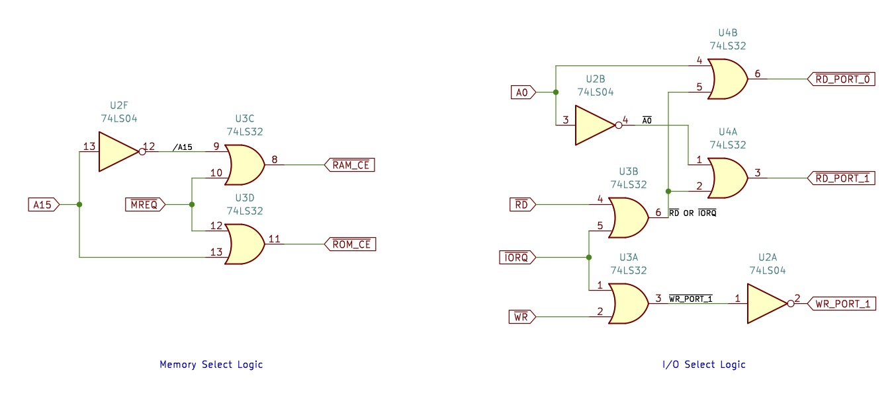
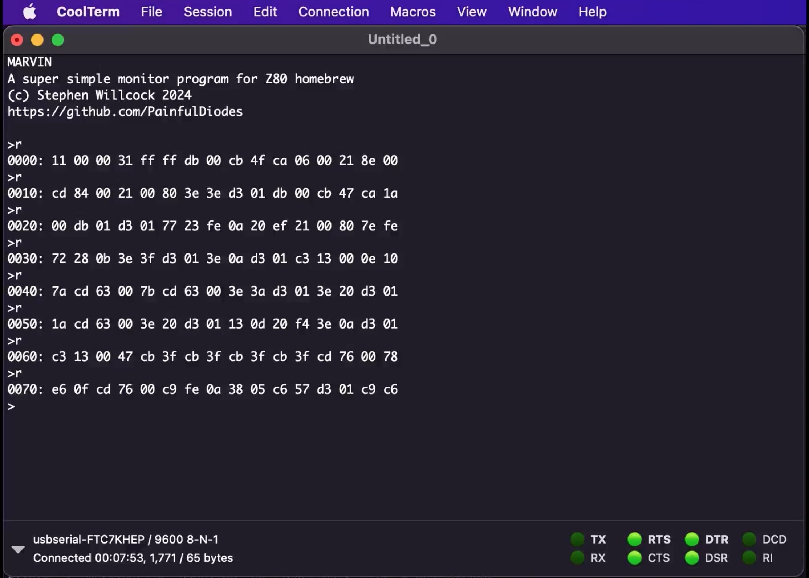
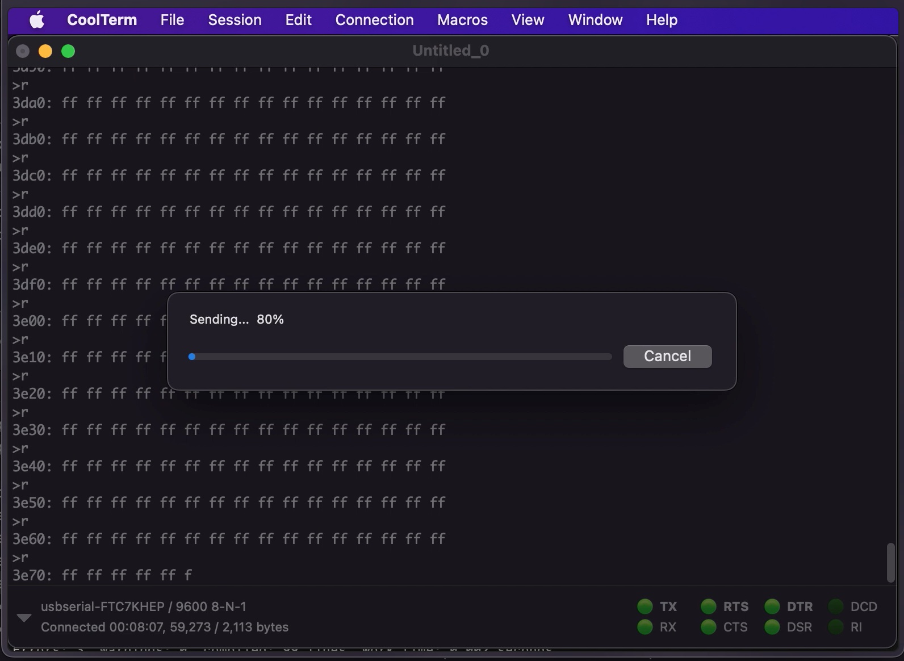

# Z80 Breadboard Computer

My first computer was a 1981 Sharp MZ-80B which had a Zilog Z80A CPU. I was a fan of the Z80 and in the early 1980s had been absorbed by homebrew circuit designs using this CPU, but despite a passion for electronics I hadn't actually attempted building anything with the chip.

During COVID-19 lockdown I reacquired my interest in DIY electronics, and at the tail end of 2023 was delighted to discover that Zilog was still producing the CPU, so I ordered a couple and in the first few months of 2024 I experimented with the device on a breadboard.

In [April 2024 Zilog announced](https://www.theregister.com/2024/04/22/z80_cpu_end_of_sales/) they would stop production of the CPU. So, I set out to build a breadboard computer, which I managed to do by the time Zilog stopped accepting orders for the device on June 14, 2024. Of course there was no particular relevance to meeting that date, other than some poetic sense of completion.

## High level design

Whilst there were many homebrew / breadboard Z80 designs online, I wanted to design the circuit myself rather than copying existing designs. Of course I learned from other projects, but then again I also made some bad choices based on naive interpretation of examples that had been simplified for educational purposes.

Designing from scratch, it was obvious to evolve the design on breadboard, being quick and easy to correct mistakes. I also found  Arduino boards invaluable during the process. I used Arduinos to provide "scaffolding" while the design took shape. Initially I used an Arduino to provide a clock to the Z80, and soon after to monitor the outputs of the chip and provide surrogate memory and I/O. Then when I added in other components to the design, I could progressively rely less and less on the Arduino until finally it could be unplugged altogether. Although I used several different boards, using a [Mega 2560](https://docs.arduino.cc/hardware/mega-2560/) is ideal, given the generous number of I/Os.

As an aside, it's worth saying that being able to use an Arduino to manipulate the CPU is possible due to the static design of the chip - it doesn't have a minimum clock speed - you can single step the processor if you wish. 

I wanted for the design to be as consistent as possible with the technology of the early 1980s, but also keeping it very simple, and using readily available components. So, there were compromises - such as use of modern memory devices.

Another consideration was to make it usable - so that it could at least demonstrate to a non-technical person that it was a functioning computer. There were two parts to this. First was to plan to connect it to a modern computer in order to interact with it via a terminal emulator. Second, I remembered vividly how 1980s computers would be ready to use instantly with monitor programs and BASIC interpreters persistently stored in ROM. So I wanted to use a ROM - I thought it would also be satisfying to see a startup message on my Mac via the terminal emulator.

## Build

Before describing the logical design in more detail, a few thoughts on putting together the circuit - physical and electrical aspects.

It may seem odd, but what didn't occur to me at the start of this project was the electrical aspect. I was drawn to digital electronics because of its logical, binary nature, and as somewone working in software development, I took a narrow perspective on the circuit paying little attention to the electrical characteristics.

At one point I spend a long time trying to work out why the final circuit *almost* worked; it worked for short periods of time, but was very unreliable, with a lot of seemingly random behaviour mixed in. I checked the logical design, and looked for poor connections on the breadboard without finding the fault. 

From my earliest experimentation I had been using a bunch of LEDs directly on the address outputs of the CPU. I finally realised that these were drawing too much current which was causing the processor to misbehave. Disconnecting the LEDs solved the issue instantly. For the first time studing the datasheet for the electrical properties of the CPU, and doing a quick calculation of current through the LEDs and series resistors made sense of the problem.

There are other electrical topics which are well worth exploration, particularly around the power supply: use of decoupling capacitors and avoiding daisy-chaining the power supply across multiple breadboards. I won't attempt to go into detail on "the whys", but will describe what I did: 

* I constructed the circuit using 9 breadboards, and the power was connected directly to each board, not daisy-chained from board to board
* Each board had a 22µF electrolytic capacitor across the power rails
* Each IC had a 0.1 µF ceramic capacitor across the power pins as close to the device as possible (in the following schematics these may not always be indicated)

Using breadboards made making changes easy, which was good - it was easy to evolve the design. The downside of this (for me at least) was that the temptation to constantly rework what I had done. I found myself making sudden decisions to change the layout because I wasn't happy with it, only to regret the decision. The ease of change meant that I needed to impose some self-discipline - taking time to consider before making a sudden change - often leaving it til the next day; there's no Ctrl-Z when you've just ripped out a bunch of wires.

Laying out the breadboard in the end I opted for a "*backplane*" design. The middle board had no components but the address bus and data bus were laid out on separate rows of the board. Wires were first run from the Z80 to the *backplane*, and then from there on to the multiple devices that needed to be connected to the bus. My thinking was that having established a logical order of these lines on the *backplane*, this would make wiring up the other devices easier - with less double-checking. However, in the end, I'm not convinced this was a great idea... it introduced an additional and unneccesary 24 wires and therefore 48 connection points on the breadboard, and the *backplane* board became very congested. I wonder now whether daisy chaining the bus would have been better, especially realising that the ROM and RAM chips helpfully had consistent pin-outs.

Finally, and likely stating the obvious... all of the ICs were ordered in DIP format - to be suitable for breadboard use - and as I found out, its easy to order the wrong package type!

* https://austinmorlan.com/posts/8bit_breadboard/
* https://forum.allaboutcircuits.com/threads/breadboard-cpu-power-problems.137051/  
* https://forum.allaboutcircuits.com/threads/decoupling-or-bypass-capacitors-why.45583/

## CPU, clock and reset

The Z80 CPU requires a 5v power supply and a ground connection, a clock input, and it provides 16 address outputs, 8 data inputs/outputs, and has a number of inputs and outputs for CPU and system control purposes.

The control lines in the schematic have a bar over the labels - this means that the line is "active low", or inverted relative to the natural or intuitive sense. You'll also see in this text the common convention to use a "/" to indicate the bar such as with "/BUSAK". 

Those control inputs which for our purposes need to remain inactive (/NMI, /INT, /WAIT, /BUSRQ) are therefore  wired to +5v (high). We'll be ignoring some of the control outputs like /BUSAK, and none of these got connected - in the schematic a small cross indicates that they are deliberately disconneced.

Some of the pins are "tri-state". The three possible states that the CPU will set are high (+5v), low (0v) or high-impedance. When a pin is being used as an output it will either be in a high or low state. The third, high-impedance state means that the pin will have no effect on any attached circuit - "no output", as if disconnected. 

Some pins are in a high-impedance state when they are being used as inputs. That's logical: if you are wanting to take input on a pin you won't want to be affecting the state of the pin yourself. 

The 8 data pins are tri-state. When the CPU is outputting data onto the data bus, the pins will be either high or low representing the data being output, but when the CPU wants to input data, the pins go to high-impedance state, and the CPU expects some other device to set the state of the data bits.

It is important that other devices that are attached to the data bus don't contend with the CPU over it - only 1 device should be outputting onto the data bus at any given time, and all other devices connected to the data bus should be in a high-impedance state. So the CPU provides the read (/RD) and (/WR) control outputs to indicate whether the CPU is reading from the bus or writing to it. 

When the CPU wants to access memory the /MREQ signal will be active in combination with a /RD or /WR signal. At this point it will also set all the address outputs to define the memory location being accessed.

The Z80 can also access input/output devices, which it treats independently from memory (accessing memory or I/O, not both at the same time). This is indicated with the /IORQ signal, and a device/port address is set on address bits 0 to 7, which allows for 256 I/O ports.

In order to execute instructions sequentially the CPU requires a "clock" signal which simply oscillates regularly between high and low states and provides the time trigger, or heartbeat which enables the CPU to take sequential steps. In the 1980s it was necessary to construct a clock circuit from a crystal and additional components. Today I am using an [ECS-2200B-100](https://www.mouser.co.uk/datasheet/2/122/ecs_2200-1284324.pdf) crystal based 10MHz clock module - another compromise made for simplicity's sake. The 10MHz speed of the clock matches the rated speed of the CPU.

The simple reset circuit has 2 functions: a reset push-button to let me reset the computer at will, and a power-on-reset which holds the computer in a reset state for a short while so that all the signals can settle before the CPU starts working. 

The 10k resistor pulls the /RESET line high (inactive) as a default state. However, when power is applied, we can assume that the 0.1 µF capacitor will be in a discharged state, and so the Z80 /RESET input is therefore low (there's a 5v drop across the 10k resistor) and so the Z80 /RESET is active. The capacitor immediately starts charging, and the rate of charging is restricted by the 10k resistor. At some point the voltage at the Z80 /RESET pin is high enough for the CPU to consider it to be high/inactive, but the rest of the circuit has now had time to settle. 

If I now want to force a reset, I can do so with the push-button. When the switch contacts close the capacitor discharges, bringing the /RESET signal low (active). The discharge current (and therefore rate) is limited by the 220R resistor. When releasing the push button, the capacitor charges in the same way as when power was applied, and so the reset state is not instantly released - this seems to help with de-bouncing of the switch - preventing multiple unintended resets that might otherwise occur. 

The [Z80 Family CPU User Manual](http://www.zilog.com/docs/z80/z80cpu_um.pdf) has been my constant companion! For a more comprehensive discussion of the pins, see the "Pin Description" in the manual overview, and to get a sense for how the clock drives the CPU and pulling all the pin functions together, see the "Timing" section. 

* http://www.zilog.com/docs/z80/z80cpu_um.pdf
* https://www.mouser.co.uk/datasheet/2/122/ecs_2200-1284324.pdf

## Memory

In the 1980s, static RAM was very expensive and often cheaper dynamic RAM would be used. Dynamic RAM needs to be regularly "refreshed" to retain data, adding to the complexity of the design, although the Z80 does provide specific support for DRAM refresh.

One particular homebrew design from that time ([PCW January 1980](https://www.worldradiohistory.com/UK/Personal-Computer-World/80s/PCW-1980-01-S-OCR.pdf)), used 21L02 SRAM which was a 1024x1 device. 8 of these were therefore needed for 1kB of RAM. The data input was separate from the output, and the output therefore required an additional tri-state buffer to avoid contention with the CPU when writing to the memory. 
 
Today I'm using an [AS6C62256](https://mou.sr/47vSkNy), 32K x 8 SRAM device, greatly simplifying the build. For ROM I am using an [AT28C64B](https://mou.sr/3ZkJdx0), 8K x 8 EEPROM. The data and address lines from both devices are connected to the respective busses. Of course for the smaller device, the upper address bits A13 and A14 are not provided, but conveniently the pin layout is consistent. 

I recently realised that I might have used an [AT28C256](https://mou.sr/47sN0dA) 32K x 8 EEPROM in place of the smaller device - making up the full 64K, which would have been nice, and in fact due to the consistency of pinouts it would drop straight in and only require connecting up A13 and A14.

Both chips have /OE (output enable) pins which are connected to the CPU /RD control output - when the CPU is reading from memory, the devices will output data onto the data bus, otherwise they will remain in a high-impedance state.

When the CPU is writing to the RAM, the /WR control line will be active, and this is connected to the RAM /WE (write enable) so that the device will take data from the bus. The EEPROM will be pre-programmed externally, and so we do not want to inadvertently program the EEPROM in this circuit, so its /WE pin is fixed in a high state.

However, the devices will only observe /RD or /WR  when their respective /CE (chip enable) lines are also active. These /RAM_CE and /ROM_CE signals are provided by the glue logic, which we will come on to shortly.

* AS6C62256 https://mou.sr/47vSkNy
* AT28C64B https://mou.sr/3ZkJdx0

## USB

Initially I intended to use a 1980's-consistent UART in my design to connect it to a modern computer, but modern computers are equipped with USB interfaces rather than simpler RS232 serial interfaces. The obvious bridge here was to use an [FTDI USB to TTL cable](https://ftdichip.com/products/ttl-232r-5v-we/). 

However, I learned from [Keith Robinson](https://hackaday.io/project/167418-ftdi-usb-cable-problems-with-6850-acia/details) that using this kind of adapter with simple UARTs can lead to data loss. As a compromise for the sake of simplicity I decided to use the suggested alternative [FTDI UM245R parallel-FIFO device](https://ftdichip.com/products/um245r/). The Z80 has to read and write data to I/O ports in 8-bit parallel in any case, and the USB device takes this data and streams it in serial over the USB. The device provides a buffer so that no data is lost, and it avoids having to  mess about with the timing of data serialization.

For sending and receiving data, the UM245R has 8, 3-state data I/O pins, and control inputs to enable read (/RD) and write (WR). I thought initially that I could enable the device's /RD it would put data on the data bus, and if there was no more data to read, then perhaps it would simply return a 0 value ([ASCII NUL](https://en.wikipedia.org/wiki/ASCII#/media/File:USASCII_code_chart.png)). However, I confirmed through experimentation that when there is no more data, the UM245R will actually continue to repeatedly provide the last byte received. We therefore will always need to ask whether there is data in the buffer before attempting to read from it.

Actually, strictly I guess reading a 0 means that a 0 value has been received, not that no value was received at all; these are different circumstances and so a separate indicator that data has been received is needed. 

The UM245R provides two outputs indicating whether it is ready to transmit data (/TXE) or whether there is data in the receive buffer (/RXF). However, for the Z80 to be able to access these status signals, they need to be readable from an address - either as memory or I/O port. The most efficient and logical representation of USB status is to have /TXE and /RXF be available as individual bits on a single byte accessed by the Z80 as an input port. 

I used a SN74LS244 buffer with 3-state outputs to accomplish this. Using the buffer, normally these status bits are disconnected from the data bus, but when the buffer is enabled, the status bits are output to the bus - /RXF as bit 0 and /TXE as bit 1 - and I have wired the other 6 bits to be set to 0. 

Similar to the memory /CE lines, the controls to enable these ports /RD_PORT_0, /RD_PORT_1, WR_PORT_1 are provided by the glue logic.

* FTDI USB TTL cable https://ftdichip.com/products/ttl-232r-5v-we/ 
* Keith Robinson - FTDI USB cable problems with 6850 ACIA https://hackaday.io/project/167418-ftdi-usb-cable-problems-with-6850-acia/details
* FTDI FAQ - How does RTS/CTS flow control work in an FTDI chip? https://www.ftdichip.com/old2020/Support/FAQs.htm
* FTDI UM245R - USB to TTL parallel FIFO https://ftdichip.com/products/um245r/
* SN74LS244 datasheet https://www.ti.com/document-viewer/sn74ls244/datasheet

## Glue Logic

The CPU outputs are not able to drive the memory and I/O devices directly. Different designs might require different configurations of memory and I/O, and it would be impractical to expect the CPU to anticipate these and cater for them. There's a logical separation - the CPU provides signals which express it's intent, but "glue logic" is required to interpret the intent specifically for the expectations of the connected devices.

I wanted to keep this logic as simple as possible, and a significant part of doing that was to minimise the number of additional devices needed. Gates come in multiples within packages: a 74LS04 package contains 6 inverters, a 74LS42 contains 4 OR gates and so on. Logic circuit design takes this into consideration - potentially choosing one design over another because of how that affects the total chip count. 

I have not spent much time considering the approaches to using gates in other designs, but have found the combination of OR gates and inverters quite natural and satisfying, given that most control signals are inverted (active when low).

The Z80 has 16 address lines and so can directly address up to 2^16 = 64kB of memory. The [AS6C62256](https://mou.sr/47vSkNy) is a 32K SRAM device and consequently it has 15 address lines, A0-A14. This device would consume half the available memory space that the Z80 can address, and so (realistically) the only question remaining is whether the RAM should occupy the upper or lower halves of the memory space.

Now, after the Z80 is reset it will start to look for instructions from address 0, and will work up through the addresses for subsequent instructions. Having decided that I would like to have some basic operating software pre-programmed into ROM, it therefore makes sense that this be located beginning from address 0 - the lower half - so that the program in ROM will start executing whenever the CPU is reset. Consequently the RAM will need to live in the upper half of the space.

| Address from        |      | Address to          |      | Use   | Page |
|---------------------|------|---------------------|------|-------|------|
| 1110 0000 0000 0000 | E000 | 1111 1111 1111 1111 | FFFF | RAM   | 7    |
| 1100 0000 0000 0000 | C000 | 1101 1111 1111 1111 | DFFF | RAM   | 6    |
| 1010 0000 0000 0000 | A000 | 1011 1111 1111 1111 | BFFF | RAM   | 5    |
| 1000 0000 0000 0000 | 8000 | 1001 1111 1111 1111 | 9FFF | RAM   | 4    |
| 0110 0000 0000 0000 | 6000 | 0111 1111 1111 1111 | 7FFF | empty | 3    |
| 0100 0000 0000 0000 | 4000 | 0101 1111 1111 1111 | 5FFF | empty | 2    |
| 0010 0000 0000 0000 | 2000 | 0011 1111 1111 1111 | 3FFF | empty | 1    |
| 0000 0000 0000 0000 | 0000 | 0001 1111 1111 1111 | 1FFF | ROM   | 0    |

Naturally the A15 line being the most significant address bit defines upper and lower half of the address space: high for upper half, and low for lower half.

Remembering these control signals are active when low, the memory select logic therefore needs to implement the following two rules:

1. /ROM_CE is active/low when /MEMREQ is active/low AND A15 is low
2. /RAM_CE is active/low when /MEMREQ is active/low AND A15 is high

So the ROM device is selected for the lower half of memory, and the RAM device is selected for the upper half, but in both cases the CPU must be signalling it is accessing memory.

We can see these rules playing out in the truth table: 

| A15 | /MREQ | /A15 | /RAM_CE | /ROM_CE |
|:---:|:-----:|:----:|:-------:|:-------:|
|  0  |   0   |  1   |    1    |    0    |
|  0  |   1   |  1   |    1    |    1    |
|  1  |   0   |  0   |    0    |    1    |
|  1  |   1   |  0   |    1    |    1    |

Using A15 to distinguish between ROM and RAM is sufficient for the design, but it does cause allow for some quirky behaviour given I am using an 8kB EEPROM. The ROM is enabled for the lower 32k, but it only provides 8k. The ROM is not connected to A13 and A14, and so these are ignored in the memory addressing/selection process. What this means in practice is that from the CPU's perspective the 8k block of ROM is effectively repeated several times. The same byte of data would be read from addresses 0x0000, 0x2000, 0x4000 and 0x6000. Instead of pages 1-3 being empty, the ROM effectively also occupies these memory pages, but this behaviour is (I think) harmless.

As an aside - I found it useful to thinking about these circuits in this way: an OR gate acts as a logical AND function for inverted signals (when they are active low): /ROM_CE is active when /MEMREQ is active AND A15 is low.

The I/O selection rules are similar. 

We have 2 I/O ports that are numbered 0 and 1. However, because we know we will ONLY have these two ports and no others, we need not think about all the 8 bits that are used to address port numbers, we can distinguish between the two ports with a single bit - A0. Similar to the ROM paging quirk noted above, port 1 will be found when the CPU addresses any odd-numbererd port, and port 0 will be found for all even-numbered ports. The port select logic therefore needs to implement the following rules:

1. /RD_PORT_0 is active/low when /IORQ is active/low AND /RD is active/low AND A0 is low
2. /RD_PORT_1 is active/low when /IORQ is active/low AND /RD is active/low AND A0 is high
3. /WR_PORT_1 is active/low when /IORQ is active/low AND /WR is active/low AND A0 is high

There's a further simplification we can make. We will only ever write to port 1, and never write to any other port, so port 1 can be enabled for writing when addressing any port for writing - so we can therefore ignore A0 when writing:

1. /RD_PORT_0 is active/low when /IORQ is active/low AND /RD is active/low AND A0 is low
2. /RD_PORT_1 is active/low when /IORQ is active/low AND /RD is active/low AND A0 is high
3. /WR_PORT_1 is active/low when /IORQ is active/low AND /WR is active/low

Note though that because the [UM245R](https://ftdichip.com/products/um245r/) expects the write signal to be active high, the /WR_PORT_1 is finally inverted.

The rules play out in the truth table:

| A0 | /RD | /IORQ | /WR | /A0 | /RD OR /IORQ | /WR_PORT_1 | /RD_PORT_0 | /RD_PORT_1 | WR_PORT_1 |
|:--:|:---:|:-----:|:---:|:---:|:------------:|:----------:|:----------:|:----------:|:---------:|
| 0  |  0  |   0   |  1  |  1  |      0       |     1      |     0      |     1      |     0     |
| 0  |  0  |   1   |  1  |  1  |      1       |     1      |     1      |     1      |     0     |
| 0  |  1  |   0   |  0  |  1  |      1       |     0      |     1      |     1      |     1     |
| 0  |  1  |   0   |  1  |  1  |      1       |     1      |     1      |     1      |     0     |
| 0  |  1  |   1   |  0  |  1  |      1       |     1      |     1      |     1      |     0     |
| 0  |  1  |   1   |  1  |  1  |      1       |     1      |     1      |     1      |     0     |
| 1  |  0  |   0   |  1  |  0  |      0       |     1      |     1      |     0      |     0     |
| 1  |  0  |   1   |  1  |  0  |      1       |     1      |     1      |     1      |     0     |
| 1  |  1  |   0   |  0  |  0  |      1       |     0      |     1      |     1      |     1     |
| 1  |  1  |   0   |  1  |  0  |      1       |     1      |     1      |     1      |     0     |
| 1  |  1  |   1   |  0  |  0  |      1       |     1      |     1      |     1      |     0     |
| 1  |  1  |   1   |  1  |  0  |      1       |     1      |     1      |     1      |     0     |
|    |     |       |     |     |              |            |            |            |           |

Note that I have skipped rows where both /RD and /WR are active as these are mutually exclusive - the CPU will never make both of them active at the same time.

## Complete Schematic

## Marvin the monitor

I have started work on an accompanying [monitor program](https://github.com/PainfulDiodes/marvin)

At this time this is not yet useful, it is sufficient though to test that all the components are working: reading instructions and data from ROM, reading and writing to RAM, interacting via the USB. It does this through printing a welcome message and then responding to "r" commands by reading from memory and printing the contents in hex. It uses RAM as a buffer for inputs, and also as a system stack. 

There are a few noteworthy (in the sense that they tie in to the circuit design) lines of code:

    SIO_CTRL .equ 0         ; serial control register address
    SIO_DATA .equ 1         ; serial data register address
    BUFFER .equ 0x8000      ; start of RAM
    STACK .equ 0xffff       ; this should really be 0x0000 as the CPU will dec SP before PUSH

As per the comments, the I/O port for status information (serial control register) is port 0 and the I/O port for data is 1 - which is what the I/O glue logic has established.

The start of RAM is defined as 8000 hex, and the initial stack address is set to the top of the RAM (ffff hex) and these also correspond to what the memory glue logic has effectively established.

* https://github.com/PainfulDiodes/marvin

## Z80 Assembly

Although my first few lines of test code were assembled by hand, an assembler speeds things up a bit. There are a number of suitable projects, and I did a quick survey, looking for something that is still being actively maintained, will run on a Mac, and is well documented.

I ended up using [sjasmplus](https://github.com/z00m128/sjasmplus), which seems well [documented](https://z00m128.github.io/sjasmplus/documentation.html) has multiple contributors, seems to have a comprehensive test suite, had some updates last year, and although there's no Mac binary the build instructions do mention Mac.

Having downloaded sjasmplus it was really simple to build, just following the [instructions](https://github.com/z00m128/sjasmplus/blob/master/INSTALL.md).

Having got to grips with the expected assembly format I managed to assemble some test code with the command:

    sjasmplus --raw=bin --lst=lst test.asm

Where bin is the output binary file, and lst is a useful listing output. I have been using sjasmplus to assemble Marvin.

* https://github.com/z00m128/sjasmplus
* https://github.com/z00m128/sjasmplus/blob/master/INSTALL.md
* https://z00m128.github.io/sjasmplus/documentation.html

## Programming the EEPROM

I had chosen an [AT28C64B](https://mou.sr/3ZkJdx0), 8K x 8 EEPROM for this design, as this seems fairly widely used in homebrew projects. The data sheet explains how to program the device, and I had read examples of using Arduinos to do the programming. However Minipro USB programmers from [XGecu](http://www.xgecu.com/EN/index.html) seem popular, with a Windows app / driver from the manufacturer and also an open source command line tool project: https://gitlab.com/DavidGriffith/minipro.

I ordered a TL866II+ device via an Amazon UK seller, but what actually arrived was a similar, and more recent T48 device. The David Griffith open source tool indicates "Experimental support for Xgecu T48 programmer", which was added in [v0.7](https://gitlab.com/DavidGriffith/minipro/-/tags/0.7)

Connecting the T48 to my Macbook, and inserting an AT28C64B into the device, I can run a few checks.

Query supported programmers:

    % minipro -Q 
    tl866a:  TL866CS/A
    tl866ii: TL866II+
    t48:     T48  (experimental)
    t56:     T56  (very experimental)

Listing the attached devices:

    % minipro -l
    Found T48 01.1.03 (0x103)
    Warning: T48 support is experimental!
    Warning: Firmware is out of date.
    Expected  01.1.31 (0x11f)
    Found     01.1.03 (0x103)
    Device code: 37B08838
    Serial code: xxxxxxxxxxxxxxxxxxxxxxxx

Read data from the AT28C64B:

    % minipro  -p AT28C64B -r data.bin
    Found T48 01.1.03 (0x103)
    Warning: T48 support is experimental!
    Warning: Firmware is out of date.
    Expected  01.1.31 (0x11f)
    Found     01.1.03 (0x103)
    Device code: 37B08838
    Serial code: xxxxxxxxxxxxxxxxxxxxxxxx
    Reading Code...  0.04Sec  OK

And view the contents:

    % hexdump data.bin 
    0000000 ffff ffff ffff ffff ffff ffff ffff ffff
    *
    0002000

And I can write the data to the AT28C64B; in this example assuming "bin" is a binary file of 119 bytes:

    % minipro -s -p AT28C64B -w bin
    Found T48 01.1.03 (0x103)
    Warning: T48 support is experimental!
    Warning: Firmware is out of date.
    Expected  01.1.31 (0x11f)
    Found     01.1.03 (0x103)
    Device code: 37B08838
    Serial code: K6ZVB9895URPKA5AJGE87295
    Use -P if you want to write-protect this chip.
    Warning: Incorrect file size: 119 (needed 8192)
    Erasing... 0.02Sec OK
    Writing Code...  0.09Sec  OK
    Reading Code...  0.00Sec  OK
    Verification OK

Also note I needed to use a switch as my binary file is a smaller size than the device size (you can suppress the warning altogether with a different switch):

    -s, --no_size_error
    Do NOT error on file size mismatch (only a warning).

* http://www.xgecu.com/EN/index.html
* https://gitlab.com/DavidGriffith/minipro

## Testing and final comments

Having assembled Marvin and programmed the binary onto an EEPROM and returned the device to the breadboard, all that remains is powering up and testing.

An inexpensive mains-powered USB PSU is recommended rather than risking powering the circuit from your computer USB. 

Having powered up and connected a USB cable for communication, you should be able to identify the UM245R from the available USB devices and send/receive data using a terminal emulator.

[CoolTerm](https://freeware.the-meiers.org/) works well for me on a Macbook.

Welcome message, and executing the "r" command several times:

Sending a batch instruction file; no data dropped and the Z80 keeps up:

With the design as it stands, it is necessary to manually reset the Z80 after powering up in order to see the welcome message. I think what is happening is there is a delay in the USB device becoming ready, which happens after the Z80 has already sent the welcome message and prompt. The "ready" signal is active-low, so it may appear to be ready while powering up? This requires further testing / analysis.

More background to all of the above can be found in the earlier experiments [here](https://painfuldiodes.wordpress.com). 

* https://freeware.the-meiers.org/ CoolTerm
* https://painfuldiodes.wordpress.com