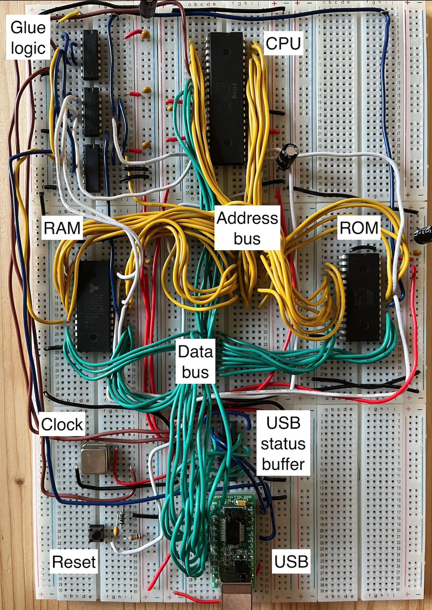
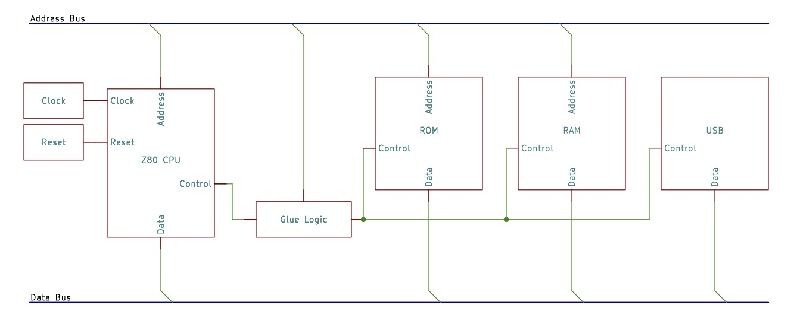
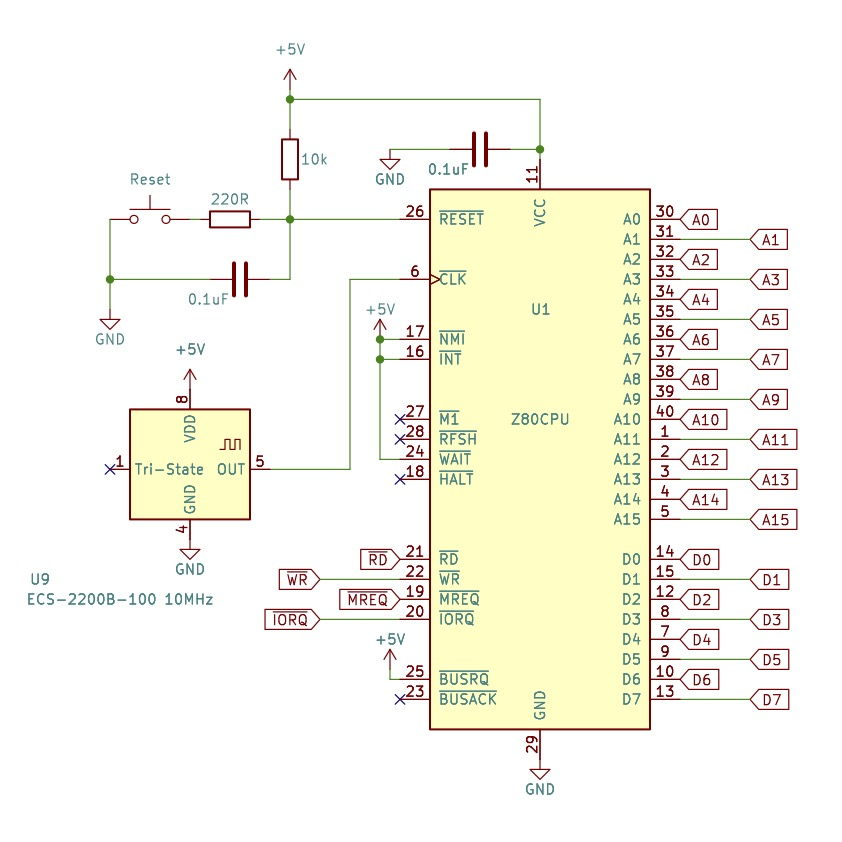
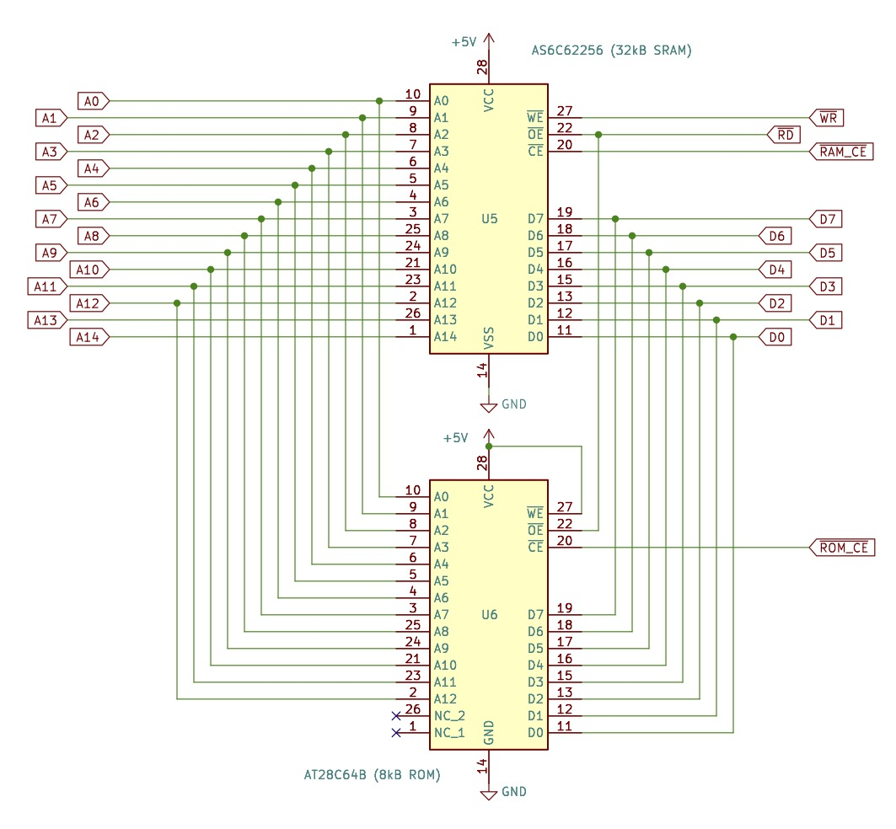
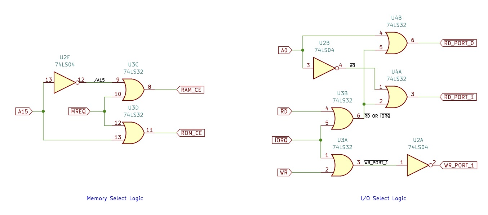

# Z80 Breadboard Computer
A simple Z80 design for breadboard using readily available components, made usable by being connected to a terminal emulator on a modern computer via USB, consistent (within reasonable bounds) with the technology of the 1980s, including having some resident software on ROM.

Further details:
* Hackaday project https://hackaday.io/project/202139-z80-breadboard-computer
* Blog post https://painfuldiodes.wordpress.com/2024/09/23/z80-breadboard-computer/
* My Z80 experiments  https://painfuldiodes.wordpress.com/category/z80-experiments/
* Marvin the monitor https://github.com/PainfulDiodes/marvin

## High level design

## Build / electrical considerations

* Circuit laid out on 9 breadboards  
* ICs in DIP packages suitable for breadboard  
* Power connected directly to each board (not daisy-chained from board to board)  
* Each board has a 22µF electrolytic capacitor across the power rails  
* Each IC has a 0.1 µF ceramic capacitor across the power pins as close to the device as possible   
* Powered by inexpensive USB PSU - rather than risking powering the circuit from a computer USB    

## CPU, clock and reset

Those control inputs which for our purposes need to remain inactive - /NMI, /INT, /WAIT, /BUSRQ - are tied high. Unused control outputs like /BUSAK, are left disconnected.

For the simple reset circuit, a reset push-button is provided to reset the computer, and a power-on-reset holds the computer in a reset state for a short period so that all the signals can settle before the CPU starts working. 

## Memory

RAM: [AS6C62256](https://mou.sr/47vSkNy), 32K x 8 SRAM.  

ROM: [AT28C64B](https://mou.sr/3ZkJdx0), 8K x 8 EEPROM. 

For the smaller device, the upper address bits A13 and A14 are not present, but otherwise the pin layouts are consistent.

An [AT28C256](https://mou.sr/47sN0dA) 32K x 8 EEPROM might be used in place of the 8K ROM - making up the full 64K. Due to the consistency of pinouts it would drop straight in and only require connecting up A13 and A14.

## USB

Having considered various options, I used an [FTDI UM245R parallel-FIFO device](https://ftdichip.com/products/um245r/) for simplicity and reliability.

I confirmed through experimentation that whenever there is no more data to read, the UM245R will continue to repeatedly provide the last byte received. It is therefore necessary to check buffer state before reading data.

The UM245R provides two status outputs: /TXE (ready to transmit data) and  /RXF (data present in the receive buffer). The USB status signals are made available to the CPU as individual bits on a single byte accessed as an input port. A buffer with 3-state outputs (SN74LS244) is used to accomplish this: when the buffer is enabled, the status bits are output to the bus - /RXF as bit 0 and /TXE as bit 1 - the other 6 bits are tied low. 

## Glue Logic

The glue logic has been kept as simple as possible, also minimising the number of packages needed. 

The ROM occupies the lowest addresses (on reset the Z80 will execute from 0x0000), and the RAM will occupy the top 32K.

The memory select logic therefore needs to implement the following two rules:

1. /ROM_CE is active/low when /MEMREQ is active/low AND A15 is low
2. /RAM_CE is active/low when /MEMREQ is active/low AND A15 is high

Using A15 to distinguish between ROM and RAM is sufficient for this design, but it does cause allow for some quirky behaviour given we are using an 8kB EEPROM. The 8k block of ROM is effectively repeated several times. The same byte of data would be read from addresses 0x0000, 0x2000, 0x4000 and 0x6000. 

The I/O selection rules are similar. 

There are 2 I/O ports that are numbered 0 and 1. However, because we know we will ONLY have these two ports and no others, we need not think about the other 7 bits that are used to address port numbers, we can distinguish between the two ports with A0. Similar to the ROM paging quirk noted above, port 1 will be active when the CPU addresses any odd-numbererd port, and port 0 will be active for all even-numbered ports. The port select logic therefore needs to implement the following rules:

1. /RD_PORT_0 is active/low when /IORQ is active/low AND /RD is active/low AND A0 is low
2. /RD_PORT_1 is active/low when /IORQ is active/low AND /RD is active/low AND A0 is high
3. /WR_PORT_1 is active/low when /IORQ is active/low AND /WR is active/low AND A0 is high

There's a further simplification: We will only write to port 1, and no other port, so port 1 can be enabled for writing when addressing any port for writing - so we can therefore ignore A0 when writing:

1. /RD_PORT_0 is active/low when /IORQ is active/low AND /RD is active/low AND A0 is low
2. /RD_PORT_1 is active/low when /IORQ is active/low AND /RD is active/low AND A0 is high
3. /WR_PORT_1 is active/low when /IORQ is active/low AND /WR is active/low

Note though that because the [UM245R](https://ftdichip.com/products/um245r/) expects the write signal to be active high, the /WR_PORT_1 is finally inverted.

## Complete Schematic

## Marvin the monitor

I have started working on an accompanying monitor program: https://github.com/PainfulDiodes/marvin

At the time of writing this is not yet useful, it is sufficient only to test that all the components are working: reading instructions and data from ROM, reading and writing to RAM, interacting via the USB. It does this through printing a welcome message and then responding to "r" commands by reading from memory and printing the contents in hex. It uses RAM as a buffer for inputs, and also as a system stack. 

## Z80 Assembly

I have been using [sjasmplus](https://github.com/z00m128/sjasmplus), which seems well [documented](https://z00m128.github.io/sjasmplus/documentation.html), has multiple contributors, seems to have a comprehensive test suite, and had some updates last year.

I found it simple to build, following the [instructions](https://github.com/z00m128/sjasmplus/blob/master/INSTALL.md).

## Programming the EEPROM

I have been using a T48 USB programmer from [XGecu](http://www.xgecu.com/EN/index.html), with  an open source command line tool: https://gitlab.com/DavidGriffith/minipro. The David Griffith open source tool indicates "Experimental support for Xgecu T48 programmer", which was added in [v0.7](https://gitlab.com/DavidGriffith/minipro/-/tags/0.7)

## Final comments and links

Having powered up and connected a USB cable for communication, I was able to identify the UM245R from the available USB devices on my Macbook and send/receive data using the [CoolTerm](https://freeware.the-meiers.org/) terminal emulator.

With the design as it stands, it is necessary to manually reset the Z80 after powering up in order to see the welcome message. I think what is happening is there is a delay in the USB device becoming ready, which happens after the Z80 has already sent the welcome message and prompt. The "ready" signal is active-low, so it may appear to be ready while powering up.

* http://www.zilog.com/docs/z80/z80cpu_um.pdf
* https://www.mouser.co.uk/datasheet/2/122/ecs_2200-1284324.pdf
* AS6C62256 https://mou.sr/47vSkNy
* AT28C64B https://mou.sr/3ZkJdx0
* FTDI UM245R - USB to TTL parallel FIFO https://ftdichip.com/products/um245r/
* SN74LS244 https://www.ti.com/document-viewer/sn74ls244/datasheet
* Keith Robinson - FTDI USB cable problems with 6850 ACIA https://hackaday.io/project/167418-ftdi-usb-cable-problems-with-6850-acia/details
* FTDI FAQ - How does RTS/CTS flow control work in an FTDI chip? https://www.ftdichip.com/old2020/Support/FAQs.htm
* https://github.com/z00m128/sjasmplus
* https://github.com/z00m128/sjasmplus/blob/master/INSTALL.md
* https://z00m128.github.io/sjasmplus/documentation.html
* https://austinmorlan.com/posts/8bit_breadboard/  
* https://forum.allaboutcircuits.com/threads/breadboard-cpu-power-problems.137051/   
* https://forum.allaboutcircuits.com/threads/decoupling-or-bypass-capacitors-why.45583/  
